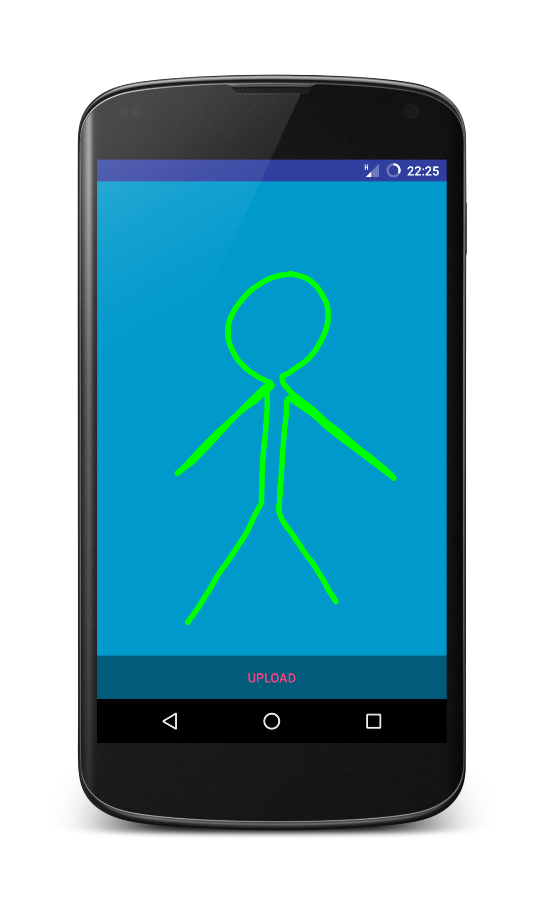
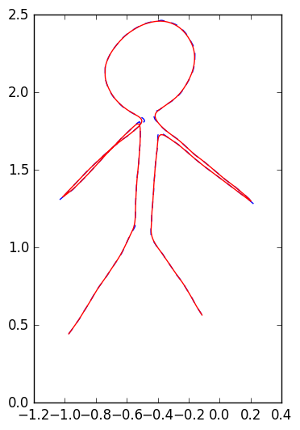

# Drone Draw Android app
#### Developed by Kristian Lauszus, 2016

The code is released under the GNU General Public License.
_________

In order to built this project you need to download [Android Studio](http://developer.android.com/sdk/index.html).

This app is to be meant to be used with the drone draw demo located at the following repository: <https://github.com/HovakimyanResearch/crazyflie-demos>.

More information can be found at the following blog post: <http://blog.tkjelectronics.dk/2016/12/painting-with-drones>.

## Video demonstraion

For more information send me an email at <lauszus@gmail.com>.
